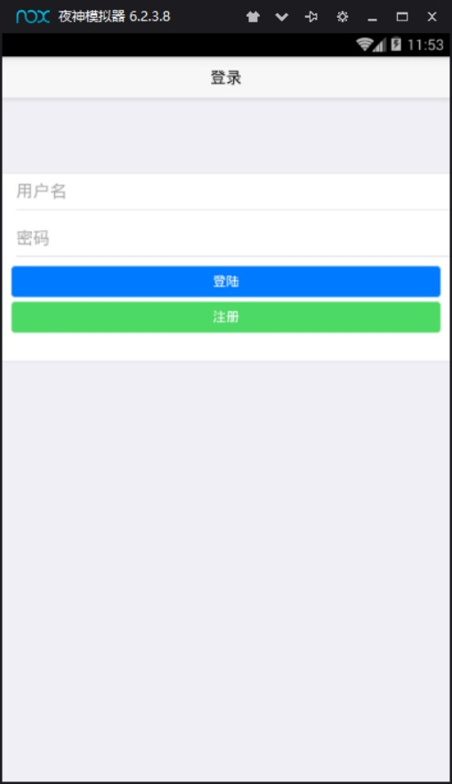
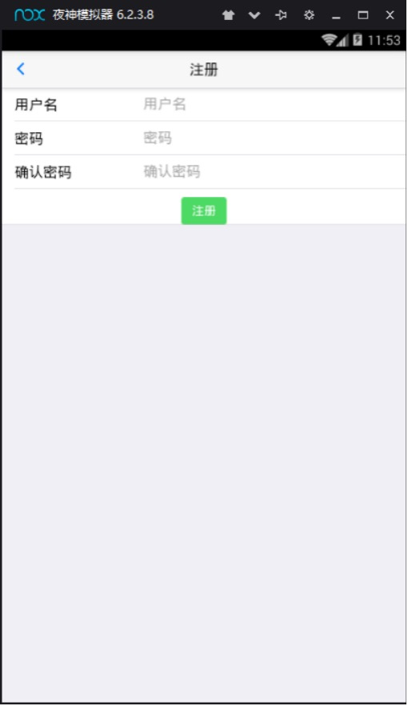
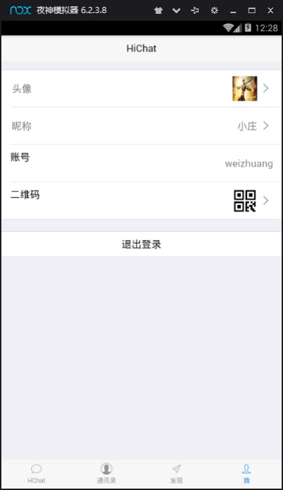
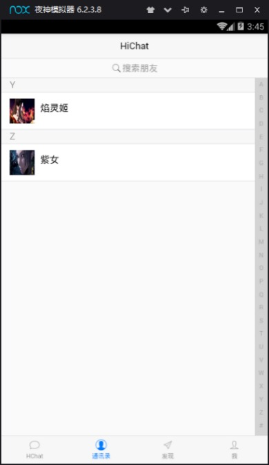
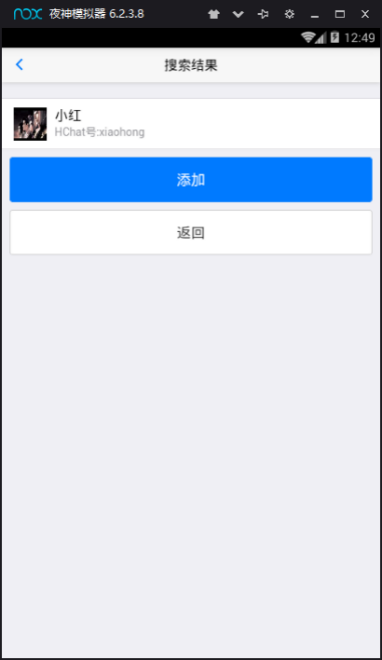
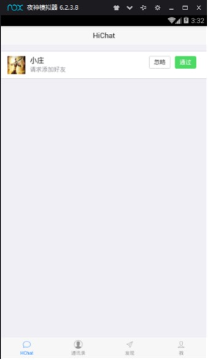

# NiuBaiDe_IM

牛掰的即时通讯(SpringBoot + Netty)

<!-- PROJECT SHIELDS -->

[![Contributors][contributors-shield]][contributors-url]
[![Forks][forks-shield]][forks-url]
[![Stargazers][stars-shield]][stars-url]
[![Issues][issues-shield]][issues-url]
[![MIT License][license-shield]][license-url]
[![LinkedIn][linkedin-shield]][linkedin-url]

<!-- PROJECT LOGO -->
<br />

<p align="center">
  <a href="https://github.com/loks666/niubaide_im/">
    
  </a>

<h3 align="center">Niubaide_im</h3>
  <p align="center">
    一个"牛掰的"即时通讯项目！
    <br />
    <a href="https://github.com/loks666/niubaide_im"><strong>探索本项目的文档 »</strong></a>
    <br />
    <br />
    <a href="https://github.com/loks666/niubaide_im">查看Demo</a>
    ·
    <a href="https://github.com/loks666/niubaide_im/issues">报告Bug</a>
    ·
    <a href="https://github.com/loks666/niubaide_im/issues">提出新特性</a>
  </p>

</p>


本篇README.md面向开发者
- 码云镜像地址 [gitee Niubaide_im](https://github.com/loks666/niubaide_im)
## 目录

- [样例](#样例)
- [上手指南](#上手指南)
    - [开发前的配置要求](#开发前的配置要求)
    - [安装步骤(前端)](#安装步骤[前端])
    - [安装步骤(后端)](#安装步骤[后端])
- [文件目录说明](#文件目录说明)
- [开发的架构](#开发的架构)
- [部署](#部署)
- [使用到的框架](#使用到的框架)
- [贡献者](#贡献者)
    - [如何参与开源项目](#如何参与开源项目)
- [版本控制](#版本控制)
- [作者](#作者)
- [鸣谢](#鸣谢)

### 样例
1. 登录  
   
2. 注册  
   
3. 个人信息  
   
4. 二维码  
   
5. 通讯录  
   
6. 添加好友  
   
7. 操作好友请求  
   
   
###### 开发前的配置要求

1. JDK版本：1.8，Maven版本：3.6
2. IDE必须安装lombok插件，否则编译报错  
   [idea安装lombok插件](https://blog.csdn.net/wochunyang/article/details/81736354)

###### **安装步骤[前端]**

1. 安装Hbuilder  [『传送门』](https://www.dcloud.io/)

```sh
`git clone https://github.com/loks666/niubaide_im.git`
```

2.使用Hbuilder打开项目

 ```sh
`cd niubaide_app`
```

3. 连接调试设备，以网易mumu模拟器为例

- 【win版】
  ```sh
  `adb connect 127.0.0.1:7555`
  `adb adb shell`
  ```
- 【mac版】
  ```sh
  `adb kill-server && adb server && adb shell`
  ```

###### **安装步骤[后端]**

1. 克隆本项目到本地

```sh
`git clone https://github.com/loks666/niubaide_im.git`
```

2. 配置maven并下载项目依赖

```sh
`mvn clean package -Dmaven.test.skip=true -Dmaven.javadoc.skip=true`
```

3. 进入打包目录

```sh
`cd niubaide_backend/target`
```

4. 启动项目

```sh
`java -jar niubaide_backend-0.0.1-SNAPSHOT.jar`
```

5. 执行数据库脚本

```sh
`path niubaide_backend/src/main/resources/sql/nchat.sql`
```

### 文件目录说明

eg:

```
niubaide_im 

├── /niubaide_im/ 项目目录
│  ├── /niubaide_app/ #前端目录
│  ├── /niubaide_backend/ #后端目录
│  └── src/main/java #项目代码
│    └──  netty #netty核心启动包
│    └──  code  #业务代码
│  └── src/main/resources
│    └──  sql/nchat.sql #数据库执行文件
│    └──  application.properties #项目配置文件
├── LICENSE.txt #Apache2.0协议文件
├── README.md #项目描述文档

```

### 开发的架构

SpringBoot-2.3.1.RELEASE + Netty-4.1.25.Final + Mybatis-Plus-3.3.2
图片上传：FastDfs-6.0.6

### 部署

src/main/resources/deploy.sh

### 使用到的框架

- [SpringBoot](https://spring.io/projects/spring-boot)
- [Netty](https://netty.io/)
- [Mybatis-Plus](https://baomidou.com/)
- [FastDfs](https://github.com/happyfish100/fastdfs)

### 贡献者

请阅读**README.md** 查阅为该项目做出贡献的开发者。

#### 如何参与开源项目

贡献使开源社区成为一个学习、激励和创造的绝佳场所。你所作的任何贡献都是**非常感谢**的。

1. Fork the Project
2. Create your Feature Branch (`git checkout -b feature/AmazingFeature`)
3. Commit your Changes (`git commit -m 'Add some AmazingFeature'`)
4. Push to the Branch (`git push origin feature/AmazingFeature`)
5. Open a Pull Request

### 版本控制

该项目使用Git进行版本管理。您可以在repository参看当前可用版本。

### 作者

@loks666

知乎:被窝探险家 &ensp; 

*您也可以在贡献者名单中参看所有参与该项目的开发者。*

### 版权说明

该项目签署了 Apache2.0 授权许可，详情请参阅 [LICENSE.txt](https://github.com/loks666/niubaide_im/blob/master/LICENSE)

### 鸣谢

- [GitHub Emoji Cheat Sheet](https://www.webpagefx.com/tools/emoji-cheat-sheet)

<!-- links -->

[your-project-path]:loks666/niubaide_im

[contributors-shield]: https://img.shields.io/github/contributors/loks666/niubaide_im.svg?style=flat-square

[contributors-url]: https://github.com/loks666/niubaide_im/graphs/contributors

[forks-shield]: https://img.shields.io/github/forks/loks666/niubaide_im.svg?style=flat-square

[forks-url]: https://github.com/loks666/niubaide_im/network/members

[stars-shield]: https://img.shields.io/github/stars/loks666/niubaide_im.svg?style=flat-square

[stars-url]: https://github.com/loks666/niubaide_im/stargazers

[issues-shield]: https://img.shields.io/github/issues/loks666/niubaide_im.svg?style=flat-square

[issues-url]: https://img.shields.io/github/issues/loks666/niubaide_im.svg

[license-shield]: https://img.shields.io/github/license/loks666/niubaide_im.svg?style=flat-square

[license-url]: https://github.com/loks666/niubaide_im/blob/master/LICENSE.txt

[linkedin-shield]: https://img.shields.io/badge/-LinkedIn-black.svg?style=flat-square&logo=linkedin&colorB=555

[linkedin-url]: https://linkedin.com/in/shaojintian


